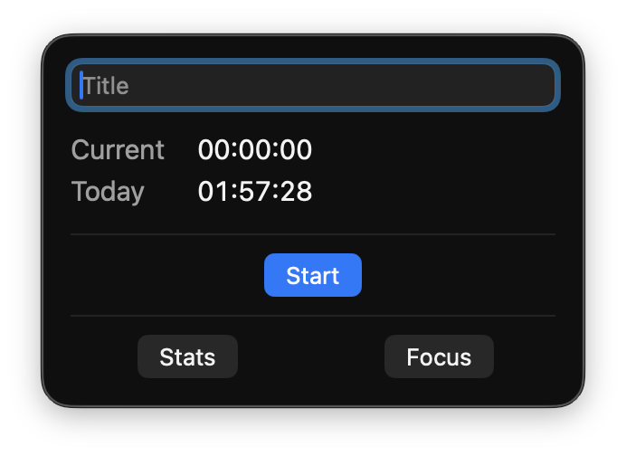
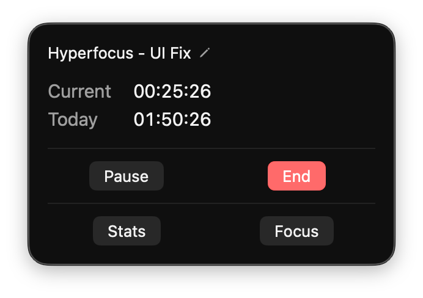
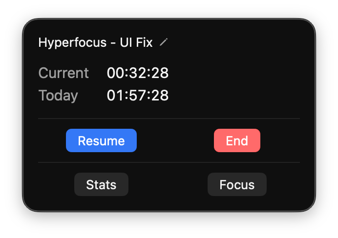
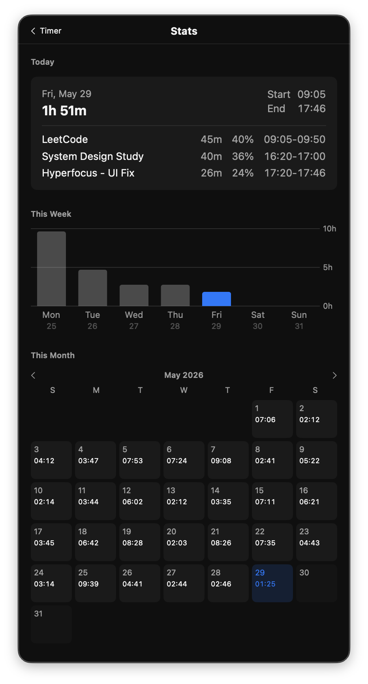
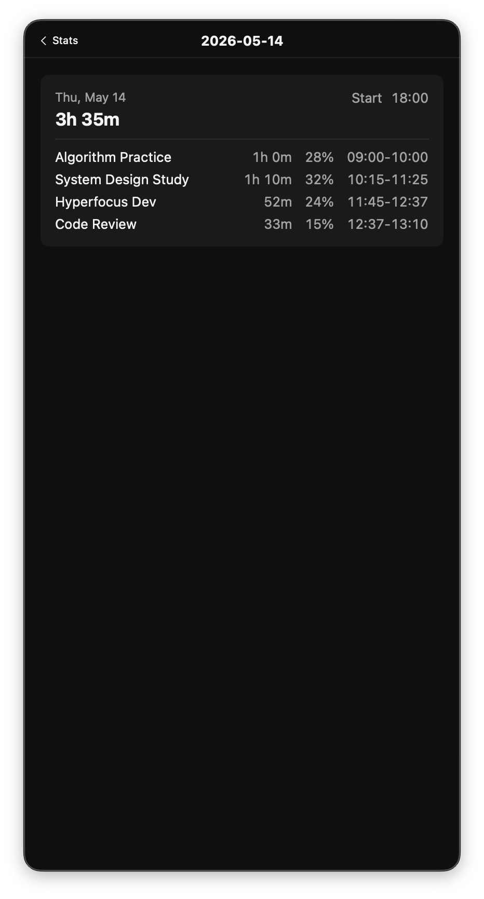
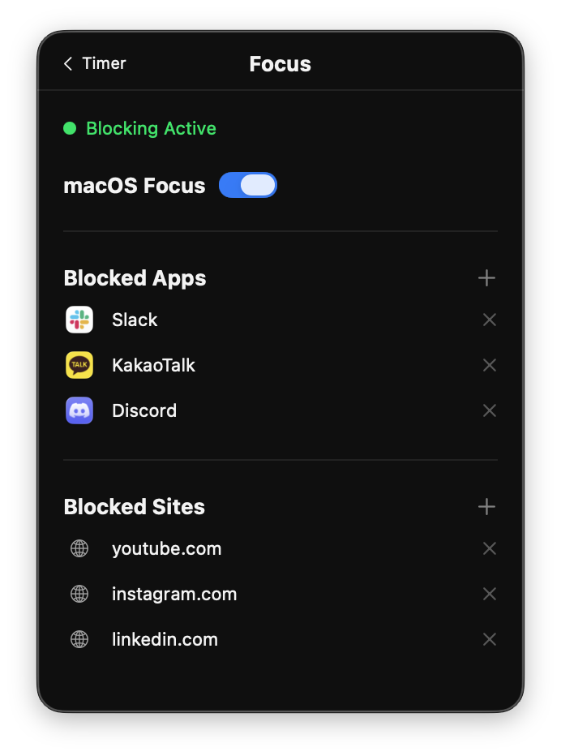

# Hyperfocus

macOS 메뉴바에서 작업 시간을 기록하고 통계를 확인하는 앱. 세션을 시작하면 방해 앱·사이트를 차단해 집중 환경을 만들어준다.

<br>

## 주요 기능

### 타이머

메뉴바 아이콘을 클릭하면 팝업이 뜨고, 세션 이름을 입력한 뒤 **Start**를 누르면 시간이 기록되기 시작한다.

<p align="center">
  
  &nbsp;&nbsp;&nbsp;&nbsp;
  
  &nbsp;&nbsp;&nbsp;&nbsp;
  
</p>

- **Current** — 현재 세션의 누적 시간
- **Today** — 오늘 모든 세션을 합산한 총 시간
- 메뉴바에 세션 이름과 타이머가 항상 두 줄로 표시되어 앱을 열지 않아도 확인 가능
- **Pause / Resume / End** 로 세션을 유연하게 제어
- 팝업이 열린 상태에서 **Space** 키로 Pause ↔ Resume 전환

### 통계

**Stats** 버튼을 누르면 오늘·이번 주·이번 달의 작업 이력을 한눈에 볼 수 있다.

<p align="center">
  
  &nbsp;&nbsp;&nbsp;&nbsp;
  
</p>

- **Today** — 오늘 기록한 세션 목록과 각 세션이 전체 시간에서 차지하는 비중(%)
- **This Week** — 이번 주 요일별 바 차트
- **This Month** — 날짜별 캘린더 뷰. 날짜를 탭하면 그날의 상세 세션 기록 확인
- 세션 이름 인라인 수정 및 삭제 가능

### Focus 연동

**Focus** 버튼에서 집중 환경을 설정한다.

<p align="center">
  
</p>

- **macOS Focus 연동** 토글 — 세션 시작·종료 시 macOS Shortcuts의 `Focus On` / `Focus Off` 단축어를 자동 실행
- **차단 앱 목록** — 현재 실행 중인 앱 중에서 골라 추가
- **차단 사이트 목록** — 도메인을 직접 입력하여 추가

### 자동 관리

- 매일 **새벽 6시** 자동 마감 — 앱이 꺼져 있거나 슬립 중이었어도 재실행 시 처리
- 시스템 **슬립 시 자동 일시정지**, 깨어난 후 수동 재개
- 앱 종료 후 재시작해도 진행 중 세션과 모든 기록 완전 복원

<br>

## 설치 및 실행

**요구사항:** macOS 14.0 이상, Xcode 15 이상

```
open Hyperfocus.xcodeproj
```

Xcode에서 `Hyperfocus` 스킴을 선택하고 **Run(⌘R)**. 코드 사이닝은 "Sign to Run Locally"로 충분하다.

<br>

## 데이터

모든 데이터는 기기 로컬에만 저장된다. 외부 서버나 클라우드 동기화 없음.

```
~/Library/Application Support/Hyperfocus/state.json
```
